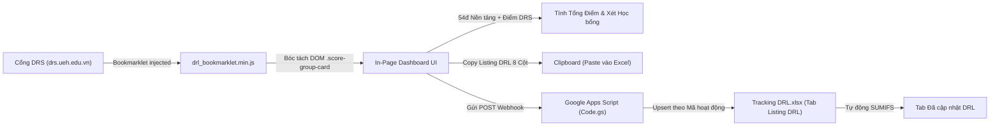

# Hướng Dẫn Vận Hành Hệ Thống Cho AI Agent (TrackDRL)

Chào mừng AI Agent! Tài liệu này cung cấp toàn bộ bối cảnh, kiến trúc, quy tắc nghiệp vụ và ràng buộc kỹ thuật của dự án **TrackDRL**. Khi làm việc trong workspace này, bạn PHẢI đọc và tuân thủ tuyệt đối các chỉ dẫn dưới đây.

---

## 1. Tổng quan Dự án

**TrackDRL** là bộ công cụ hỗ trợ sinh viên Đại học Kinh tế TP.HCM (UEH - ISB, khóa K50 IBUS) tự động hóa việc theo dõi, tính toán và đồng bộ Điểm Rèn Luyện (DRL):
1. **Bookmarklet (`drl_bookmarklet.js`):** Chạy trực tiếp trên trình duyệt tại trang điểm rèn luyện `drs.ueh.edu.vn`. Trích xuất các hoạt động đã hoàn thành (100%), tính điểm tổng theo đúng quy chế UEH (cộng 54.0 điểm nền tảng và áp trần 5 tiêu chí), hiển thị dashboard trực quan ngay trên trang.
2. **Xuất & Đồng bộ Sheet:** Cung cấp tính năng copy danh sách 8 cột chuẩn hoặc đồng bộ tự động 1-click qua Google Apps Script (`Code.gs`) vào file mẫu [Tracking DRL.xlsx](file:///home/ceeka/Documents/TrackDRL/Tracking%20DRL.xlsx).
3. **Landing Page (`index.html` / `install.html`):** Trang web hướng dẫn cài đặt kéo thả bookmarklet đa trình duyệt (Firefox, Chrome, Safari) và phân phối mã nguồn.

---

## 2. Sơ đồ Luồng Dữ liệu (Dataflow)



---

## 3. Bản đồ Mã nguồn (Codebase Map)

| Đường dẫn file | Vai trò / Mô tả nhiệm vụ |
| :--- | :--- |
| [drl_bookmarklet.js](file:///home/ceeka/Documents/TrackDRL/drl_bookmarklet.js) | Mã nguồn gốc (chưa nén) của bookmarklet. Chứa logic scrape DOM, tính toán điểm DRL và render UI Dashboard in-page. |
| [drl_bookmarklet.min.js](file:///home/ceeka/Documents/TrackDRL/drl_bookmarklet.min.js) | File build nén tối đa qua `terser`. Đảm bảo kích thước URL-encoded luôn $\le 65,536$ bytes để tương thích Firefox. |
| [index.html](file:///home/ceeka/Documents/TrackDRL/index.html) | Trang chủ landing page, chứa nút kéo thả bookmarklet, hướng dẫn cài đặt và modal hướng dẫn setup Apps Script. |
| [install.html](file:///home/ceeka/Documents/TrackDRL/install.html) | Trang phụ tương đương `index.html` cho các kịch bản redirect/cài đặt trực tiếp. Luôn giữ đồng bộ với `index.html`. |
| [google_apps_script.js](file:///home/ceeka/Documents/TrackDRL/google_apps_script.js) | Mã nguồn `Code.gs` triển khai Web App trên Google Apps Script, xử lý upsert dữ liệu vào Google Sheets. |
| [Tracking DRL.xlsx](file:///home/ceeka/Documents/TrackDRL/Tracking%20DRL.xlsx) | File Excel bảng tính mẫu chuẩn của người dùng, gồm 2 tab `Listing DRL` và `Đã cập nhật DRL`. |
| [.gitignore](file:///home/ceeka/Documents/TrackDRL/.gitignore) | Cấu hình loại trừ file cá nhân, dump web DRS và file nhạy cảm khỏi Git. |

---

## 4. Chi tiết Bộ Quy tắc Nghiệp vụ & Kỹ thuật

### 4.1. Nghiệp vụ Tính Điểm DRL UEH (K50 IBUS)
- **Tổng điểm tối đa:** 100.0 điểm = Tổng $\min(\text{TC}_i, \text{Trần}_i)$.
- **Điểm nền tảng (Cho sẵn):** Cố định **54.0 điểm**:
  - Mục 1.1: **15.0đ** (Ý thức học tập, chấp hành nội quy học tập)
  - Mục 2.1: **10.0đ** (Chấp hành nội quy, quy chế UEH)
  - Mục 2.2.1: **4.0đ** (GPA Giỏi - K50 IBUS)
  - Mục 3.1: **5.0đ** (Ý thức tham gia hoạt động CT-XH)
  - Mục 4.1: **10.0đ** (Phẩm chất công dân, quan hệ cộng đồng)
  - Mục 5.1: **10.0đ** (Công tác phụ trách lớp, đoàn thể)
- **Trần 5 tiêu chí (Max Caps):**
  - **TC1:** Tối đa 25.0đ (Nền tảng 15đ + Cần thêm tối đa 10đ từ web)
  - **TC2:** Tối đa 20.0đ (Nền tảng 14đ + Cần thêm tối đa 6đ từ web)
  - **TC3:** Tối đa 20.0đ (Nền tảng 5đ + Cần thêm tối đa 15đ từ web)
  - **TC4:** Tối đa 15.0đ (Nền tảng 10đ + Cần thêm tối đa 5đ từ web)
  - **TC5:** Tối đa 20.0đ (Nền tảng 10đ + Cần thêm tối đa 10đ từ web)
- **Điều kiện xét học bổng ISB:**
  - Khá: $\ge 65.0$đ (100% học bổng)
  - Tốt: $\ge 80.0$đ (120% học bổng)
  - Xuất sắc: $\ge 90.0$đ (150% học bổng)
- **Scraping Rule:**
  - Chỉ tính hoạt động đạt `100%`.
  - Phải dùng selector lá `.score-group-card` (hoặc truy vấn danh sách dòng cụ thể), TUYỆT ĐỐI KHÔNG dùng `.card` vì sẽ trúng thẻ container tổng gây nhân đôi điểm.

### 4.2. Cấu trúc Bảng tính Tracking DRL.xlsx & Apps Script
- **Tab `Listing DRL` (Bảng `Listing`):** Đúng thứ tự 8 cột chuẩn:
  1. `Hoạt động` (Tên hoạt động)
  2. `Mã hoạt động` (Primary Key dùng để Upsert)
  3. `Mục` (Mã tiêu chí con, ví dụ: `1.2.1`, `3.2.1`)
  4. `Tình trạng 100%` (Giá trị chuẩn: `"100%"`)
  5. `Điểm` (Điểm số thực)
  6. `Đóng tiền` (Chi phí: `"Miễn phí"`, `"50.000đ"`)
  7. `Link` (URL minh chứng)
  8. `Note` (Ghi chú riêng của sinh viên)
- **Tab `Đã cập nhật DRL`:**
  - Công thức: `=SUMIFS(Listing[Điểm], Listing[Mục], A..., Listing[Tình trạng 100%], "100%")`
  - Khung tổng kết 5 tiêu chí tại ô `G1:J7`.
- **Nguyên tắc Đồng bộ Apps Script (`google_apps_script.js`):**
  - Thực hiện **Upsert theo Mã hoạt động**.
  - **Bảo tồn dòng nhập tay:** Không được xóa đè hoặc xóa sheet (`clear()` là vi phạm nghiêm trọng). Các hoạt động ngoại tuyến do sinh viên tự thêm phải được giữ nguyên.
  - **Bảo tồn cột `Note`:** Giữ nguyên ghi chú cá nhân của sinh viên.

### 4.3. Ràng buộc Kỹ thuật & Build
- **Giới hạn Bookmarklet Firefox 64KB:**
  - URL bookmarklet trên Firefox bị chặn nếu $> 65,536$ bytes.
  - Khi chỉnh sửa [drl_bookmarklet.js](file:///home/ceeka/Documents/TrackDRL/drl_bookmarklet.js), bắt buộc chạy `terser`:
    ```bash
    terser drl_bookmarklet.js -c -m --comments false -o drl_bookmarklet.min.js
    ```
  - Kiểm tra `url.length <= 65536`. Cập nhật `href` trong cả `index.html` và `install.html`.
  - Thẻ `<a>` kéo bookmarklet luôn có `draggable="true"`.
- **Hiển thị & Copy Code Apps Script Modal:**
  - Dùng thẻ `<pre style="white-space: pre !important;">` và gán/đọc bằng `.textContent` để Firefox không gộp code thành 1 dòng.
  - Luôn duy trì nút "Tải file Code.gs" trực tiếp dưới dạng Blob.

### 4.4. Bảo mật Thông tin Cá nhân (Zero-Leakage Policy)
- Tuyệt đối không commit: MSSV, họ tên thật, email sinh viên, token/cookie vào Git repository.
- Dùng placeholder (`Sinh viên UEH`, `ACT_2026_XXXX`, `https://drs.ueh.edu.vn/...`) cho ví dụ hoặc test.
- Thư mục `drs.ueh.edu.vn/` chứa dump dữ liệu thật của người dùng -> **Luôn nằm trong `.gitignore`**, không bao giờ được commit lên GitHub.

---

## 5. Quy trình Kiểm thử & Commit Chuẩn

1. **Khi thay đổi Bookmarklet:** Sửa `drl_bookmarklet.js` $\rightarrow$ Nén `terser` $\rightarrow$ Kiểm tra kích thước $\le 65,536$ bytes $\rightarrow$ Đồng bộ `index.html` & `install.html`.
2. **Trước khi commit:** Chạy `git status` và `git diff --staged` để kiểm tra độ sạch và tính riêng tư.
