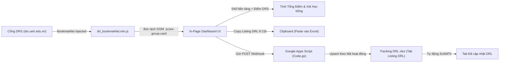

# Hướng Dẫn Vận Hành Hệ Thống Cho AI Agent (TrackDRL)

Chào mừng AI Agent! Tài liệu này cung cấp toàn bộ bối cảnh, kiến trúc, quy tắc nghiệp vụ và ràng buộc kỹ thuật của dự án **TrackDRL**. Khi làm việc trong workspace này, bạn PHẢI đọc và tuân thủ tuyệt đối các chỉ dẫn dưới đây.

---

## 1. Tổng quan Dự án

**TrackDRL** là bộ công cụ hỗ trợ sinh viên Đại học Kinh tế TP.HCM (UEH - ISB, khóa K50 IBUS) tự động hóa việc theo dõi, tính toán và đồng bộ Điểm Rèn Luyện (DRL):
1. **Bookmarklet (`drl_bookmarklet.js`):** Chạy trực tiếp trên trình duyệt tại trang điểm rèn luyện `drs.ueh.edu.vn`. Trích xuất các hoạt động đã hoàn thành (100%), tính điểm tổng theo đúng quy chế UEH (cộng 54.0 điểm nền tảng và áp trần 5 tiêu chí), hiển thị dashboard trực quan ngay trên trang.
2. **Xuất & Đồng bộ Sheet:** Cung cấp tính năng copy danh sách 8 cột chuẩn hoặc đồng bộ tự động 1-click qua Google Apps Script (`Code.gs`) vào file mẫu [Tracking DRL.xlsx](file:///home/ceeka/Documents/TrackDRL/Tracking%20DRL.xlsx).
3. **Landing Page (`index.html` / `install.html`):** Trang web hướng dẫn cài đặt kéo thả bookmarklet đa trình duyệt (Firefox, Chrome, Safari) và phân phối mã nguồn.

---

## 2. Sơ đồ Luồng Dữ liệu (Dataflow)



---

## 3. Bản đồ Mã nguồn (Codebase Map)

| Đường dẫn file | Vai trò / Mô tả nhiệm vụ |
| :--- | :--- |
| [drl_bookmarklet.js](file:///home/ceeka/Documents/TrackDRL/drl_bookmarklet.js) | Mã nguồn gốc (chưa nén) của bookmarklet. Chứa logic scrape DOM, tính toán điểm DRL và render UI Dashboard in-page. |
| [drl_bookmarklet.min.js](file:///home/ceeka/Documents/TrackDRL/drl_bookmarklet.min.js) | File build nén tối đa qua `terser`. Đảm bảo kích thước URL-encoded luôn $\le 65,536$ bytes để tương thích Firefox. |
| [index.html](file:///home/ceeka/Documents/TrackDRL/index.html) | Trang chủ landing page, chứa nút kéo thả bookmarklet, hướng dẫn cài đặt và modal hướng dẫn setup Apps Script. |
| [install.html](file:///home/ceeka/Documents/TrackDRL/install.html) | Trang phụ tương đương `index.html` cho các kịch bản redirect/cài đặt trực tiếp. Luôn giữ đồng bộ với `index.html`. |
| [google_apps_script.js](file:///home/ceeka/Documents/TrackDRL/google_apps_script.js) | Mã nguồn `Code.gs` triển khai Web App trên Google Apps Script, xử lý upsert dữ liệu vào Google Sheets. |
| [Tracking DRL.xlsx](file:///home/ceeka/Documents/TrackDRL/Tracking%20DRL.xlsx) | File Excel bảng tính mẫu chuẩn của người dùng, gồm 2 tab `Listing DRL` và `Đã cập nhật DRL`. |
| [.gitignore](file:///home/ceeka/Documents/TrackDRL/.gitignore) | Cấu hình loại trừ file cá nhân, dump web DRS và file nhạy cảm khỏi Git. |
| [.agents/rules/](file:///home/ceeka/Documents/TrackDRL/.agents/rules/) | Thư mục chứa 4 bộ quy tắc chuyên sâu của dự án (xem mục 4). |

---

## 4. Hệ thống Quy tắc Chuyên biệt (`.agents/rules/`)

Trước khi thực hiện thay đổi mã nguồn, Agent phải đọc kỹ quy tắc tương ứng:

1. [Rule 01: Nghiệp vụ DRL UEH K50 IBUS](file:///home/ceeka/Documents/TrackDRL/.agents/rules/01-ueh-drl-domain.md)
   - **54.0 điểm nền tảng:** 1.1 (15đ), 2.1 (10đ), 2.2.1 GPA (4đ), 3.1 (5đ), 4.1 (10đ), 5.1 (10đ).
   - **Trần 5 tiêu chí:** TC1 (max 25đ), TC2 (max 20đ), TC3 (max 20đ), TC4 (max 15đ), TC5 (max 20đ) $\rightarrow$ Tổng tối đa 100đ.
   - **Mức học bổng ISB:** Khá ($\ge 65$đ), Tốt ($\ge 80$đ), Xuất sắc ($\ge 90$đ).
2. [Rule 02: Bảng tính Tracking DRL & Apps Script](file:///home/ceeka/Documents/TrackDRL/.agents/rules/02-sheet-sync-schema.md)
   - Bảng `Listing` 8 cột chuẩn: `[Hoạt động, Mã hoạt động, Mục, Tình trạng 100%, Điểm, Đóng tiền, Link, Note]`.
   - Cơ chế Upsert theo `Mã hoạt động` - Tuyệt đối không xóa hoạt động nhập tay và giữ nguyên cột `Note`.
3. [Rule 03: Ràng buộc Kỹ thuật & Build](file:///home/ceeka/Documents/TrackDRL/.agents/rules/03-technical-constraints.md)
   - Giới hạn Firefox Bookmarklet: Kích thước URL $\le 65,536$ bytes. Bắt buộc nén qua `terser`.
   - Thuộc tính `draggable="true"` cho thẻ `<a>`.
   - Tránh lỗi newline Google Apps Script modal: Dùng `<pre white-space: pre !important>`, gán bằng `.textContent`, có nút tải file `.gs`.
4. [Rule 04: Bảo mật Thông tin Cá nhân](file:///home/ceeka/Documents/TrackDRL/.agents/rules/04-privacy-security.md)
   - Không rò rỉ MSSV, họ tên thật, token, cookie.
   - `drs.ueh.edu.vn/` phải luôn được gitignore, không bao giờ được commit lên remote.

---

## 5. Quy trình Phát triển Tiêu chuẩn (Standard Workflows)

### Khi sửa đổi Bookmarklet:
1. Chỉnh sửa mã nguồn trong [drl_bookmarklet.js](file:///home/ceeka/Documents/TrackDRL/drl_bookmarklet.js).
2. Chạy lệnh nén terser:
   ```bash
   terser drl_bookmarklet.js -c -m --comments false -o drl_bookmarklet.min.js
   ```
3. Kiểm tra kích thước URL-encoded $\le 65,536$ bytes.
4. Cập nhật chuỗi mã nén vào thuộc tính `href` trong cả hai file [index.html](file:///home/ceeka/Documents/TrackDRL/index.html) và [install.html](file:///home/ceeka/Documents/TrackDRL/install.html).

### Khi chuẩn bị Commit Git:
1. Kiểm tra `git status`: Xác nhận không có file nhạy cảm trong staged.
2. Kiểm tra `git diff --staged`: Rà soát không có MSSV, tên thật của người dùng.
3. Viết commit message rõ ràng, cô đọng bằng Tiếng Việt hoặc Tiếng Anh chuẩn.
